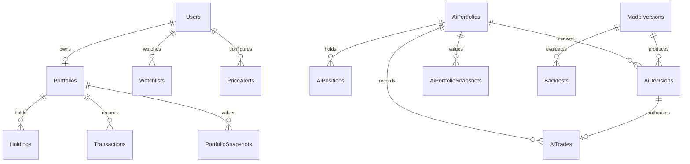

# StockLab relational schema

Design for issue #20. This document specifies the target relational model for
Azure SQL; it does not create tables, EF Core entities, migrations or cloud
resources. Those implementations belong to their respective issues.

## Conventions and boundaries

- `Id` is a `uniqueidentifier` primary key on every table.
- Columns are required unless marked `NULL`. Dates use `datetime2(7)` in UTC.
- Monetary amounts and prices use `decimal(19,4)`; share quantities use
  `decimal(19,8)` to permit fractional shares. Floating-point types are excluded.
- Currency is `char(3)`, initially USD. Each portfolio uses one currency; orders
  and valuations in another currency are rejected until FX support is designed.
- Symbols use `nvarchar(32)`, trimmed and normalized to uppercase. The configured
  market-data provider must resolve them unambiguously; exchange-qualified
  identifiers are required if a ticker is ambiguous. No persistent stock catalog
  or market-data cache is introduced by this schema.
- Status values below are `varchar` columns with database CHECK constraints.
- Mutable aggregates use SQL Server `rowversion` for optimistic concurrency;
  `rowversion` is not a date or business sequence number.
- Foreign keys use NO ACTION on delete. No cascading deletion of financial or
  decision history is allowed. Account deletion/anonymization is a separate policy.
- All tables and accounts describe paper trading only. No broker credentials or
  real execution identifiers are stored.

## Relationships

The user-to-portfolio relationship is zero-or-one at the database level. Issue #19
will create exactly one portfolio with registration in the same transaction.
User portfolios and AI portfolios occupy separate tables; the shared trading
engine will apply identical accounting rules without sharing balances or positions.

## User and paper-trading tables

### Users

| Column | Type / constraint |
| --- | --- |
| Id | Primary key |
| DisplayName | `nvarchar(100)`, nonblank |
| Email | `nvarchar(254)`, nonblank |
| NormalizedEmail | `nvarchar(254)`, unique, nonblank |
| PasswordHash | `nvarchar(1024)`; only the encoded output of the chosen password hasher |
| CreatedAtUtc | `datetime2(7)` |
| UpdatedAtUtc | `datetime2(7)`, >= CreatedAtUtc |
| Version | `rowversion` |

Registration normalizes email consistently before lookup and insert. The unique
index prevents concurrent duplicate registrations. Hash format, validation and
authentication are implemented by #16/#17, not by this document.

### Portfolios

| Column | Type / constraint |
| --- | --- |
| Id | Primary key |
| UserId | FK Users.Id, unique |
| Currency | `char(3)`, initially USD |
| InitialCapital | `decimal(19,4)`, default 100000.0000, > 0 |
| CashBalance | `decimal(19,4)`, default 100000.0000, >= 0 |
| CreatedAtUtc | `datetime2(7)` |
| Version | `rowversion` |

InitialCapital is immutable after creation. The application assigns exactly
100000.0000 USD at registration; other funding operations are outside V1.

### Holdings

| Column | Type / constraint |
| --- | --- |
| Id | Primary key |
| PortfolioId | FK Portfolios.Id |
| Symbol | Normalized symbol |
| Quantity | `decimal(19,8)`, > 0 |
| AverageCost | `decimal(19,4)`, > 0 |
| UpdatedAtUtc | `datetime2(7)` |

Unique (PortfolioId, Symbol). Fully sold holdings are removed; their transactions
remain. AverageCost is the weighted acquisition cost per share, not a market quote.
Holdings mutate only inside a transaction that also updates the parent portfolio
with its concurrency token.

### Transactions

| Column | Type / constraint |
| --- | --- |
| Id | Primary key |
| PortfolioId | FK Portfolios.Id |
| OrderId | `uniqueidentifier`, unique within PortfolioId |
| Side | `varchar(4)`: BUY or SELL |
| Symbol | Normalized symbol |
| Quantity | `decimal(19,8)`, > 0 |
| ExecutionPrice | `decimal(19,4)`, > 0 |
| TotalAmount | `decimal(19,4)`, > 0 |
| ExecutedAtUtc | `datetime2(7)` |

Append-only ledger of successful executions. TotalAmount is Quantity multiplied
by ExecutionPrice, rounded once to four decimals (midpoints away from zero);
the exact same amount updates cash. Orders rounding to zero are rejected.
No fees, deposits, short sales or partial fills are modeled in V1.
OrderId is a stable operation identifier for retries, not a broker order ID.

### Watchlists

Each row is one watched symbol for a user; V1 has one implicit list per user.

| Column | Type / constraint |
| --- | --- |
| Id | Primary key |
| UserId | FK Users.Id |
| Symbol | Normalized symbol |
| CreatedAtUtc | `datetime2(7)` |

Unique (UserId, Symbol). Rows can be removed independently of holdings and alerts.

### PriceAlerts

| Column | Type / constraint |
| --- | --- |
| Id | Primary key |
| UserId | FK Users.Id |
| Symbol | Normalized symbol |
| Currency | `char(3)`, initially USD |
| Condition | `varchar(5)`: Above or Below |
| TargetPrice | `decimal(19,4)`, > 0 |
| Status | `varchar(9)`: Active, Disabled or Triggered |
| TriggeredPrice | `decimal(19,4)`, NULL unless Triggered; > 0 when present |
| TriggeredAtUtc | `datetime2(7)`, NULL unless Triggered |
| CreatedAtUtc | `datetime2(7)` |
| UpdatedAtUtc | `datetime2(7)`, >= CreatedAtUtc |
| Version | `rowversion` |

CHECK: Triggered requires both trigger fields; other statuses require both NULL.
TriggeredAtUtc must be >= CreatedAtUtc when present. Multiple targets for the same
symbol are allowed. The monitor shares a quote across alerts for the same symbol
and currency. Proposed condition semantics are strict `price > target` for Above
and `price < target` for Below. Triggered is terminal; creating another alert is
required to rearm. The status change uses a conditional atomic update from Active
so two workers cannot record the same trigger twice.

## AI Trader and ML metadata

### AiPortfolios

Id, Name (`nvarchar(100)`, unique, nonblank), Currency, InitialCapital,
CashBalance, CreatedAtUtc and Version have the same financial types and constraints
as Portfolios. Initial capital is 100000.0000 USD. There is no UserId or foreign
key to Portfolios. V1 provisions one bot portfolio; a unique Name identifies it.

### AiPositions

Id, AiPortfolioId (FK AiPortfolios.Id), Symbol, Quantity, AverageCost and
UpdatedAtUtc mirror Holdings. Unique (AiPortfolioId, Symbol). Quantity and cost
are positive. Updates participate in the parent AI portfolio concurrency check.

### ModelVersions

| Column | Type / constraint |
| --- | --- |
| Id | Primary key |
| Version | `nvarchar(64)`, unique, nonblank |
| Algorithm | `nvarchar(100)`, nonblank |
| TrainedAtUtc | `datetime2(7)` |
| TrainingDataStartUtc | `datetime2(7)` |
| TrainingDataEndUtc | `datetime2(7)`, >= TrainingDataStartUtc and <= TrainedAtUtc |
| Status | `varchar(9)`: Candidate, Active or Archived |
| ArtifactObjectKey | `nvarchar(1024)`, NULL until stored |
| EvaluationMetricsJson | `nvarchar(max)`, NULL or valid JSON object |

One filtered unique index on Status where Status = 'Active' enforces at most one
active model for the V1 bot. Candidate allows evaluation before promotion. Model
identity and training metadata remain immutable; promotion changes status in a
transaction. Store an S3 object key only, never a signed URL, token or model binary.
JSON metrics contain named values and their evaluation window, not credentials.

### AiDecisions

| Column | Type / constraint |
| --- | --- |
| Id | Primary key |
| AiPortfolioId | FK AiPortfolios.Id |
| ModelVersionId | FK ModelVersions.Id |
| Signal | `varchar(4)`: BUY, SELL or HOLD |
| Symbol | Normalized symbol |
| Confidence | `decimal(9,8)`, between 0 and 1 inclusive |
| ApprovedQuantity | `decimal(19,8)`, > 0 only for Approved BUY/SELL; otherwise NULL |
| RiskStatus | `varchar(13)`: Pending, Approved, Rejected or NotApplicable |
| RejectionReason | `nvarchar(1000)`, nonblank only when Rejected, otherwise NULL |
| CreatedAtUtc | `datetime2(7)` |
| EvaluatedAtUtc | `datetime2(7)`, NULL until evaluated |
| Version | `rowversion` |

CHECK: HOLD requires NotApplicable and no evaluation timestamp. BUY/SELL require
Pending, Approved or Rejected. Pending has no evaluation timestamp; Approved and
Rejected require one >= CreatedAtUtc. Unique (Id, AiPortfolioId) supports the
composite foreign key from AiTrades. ModelVersionId preserves the exact model
even after another version becomes active. Signal, model and confidence are
immutable; only risk evaluation fields transition. Risk approval alone is not
evidence of execution: execution is represented by an AiTrades row.

The ML model supplies only BUY/SELL/HOLD and confidence, not a trade quantity.
The Risk Manager approves or rejects the decision and determines ApprovedQuantity
for an approved BUY/SELL before forwarding it to the Paper Trading Engine.
CHECK: Pending, Rejected and HOLD/NotApplicable require ApprovedQuantity = NULL;
Approved BUY/SELL require ApprovedQuantity > 0. ApprovedQuantity is part of the
risk evaluation fields, not the immutable ML output.

### AiTrades

Id, AiPortfolioId (FK AiPortfolios.Id), Side, Symbol, Quantity, ExecutionPrice,
TotalAmount and ExecutedAtUtc follow Transactions types and accounting rules.
DecisionId is required and unique, permitting at most one full execution per
decision. FK (DecisionId, AiPortfolioId) references AiDecisions (Id, AiPortfolioId)
to prevent attaching a decision from another AI portfolio. It also serves as the
retry key for execution.

The application must check that the decision is Approved, is BUY/SELL, and matches
the trade's side and symbol. AiTrades.Quantity must equal the decision's
ApprovedQuantity determined by the Risk Manager. A foreign key alone cannot enforce
these cross-table rules. Execution checks current cash and positions again, even
after risk approval; failure leaves no trade row and no financial updates.

### Backtests

| Column | Type / constraint |
| --- | --- |
| Id | Primary key |
| ModelVersionId | FK ModelVersions.Id |
| PeriodStartUtc | `datetime2(7)` |
| PeriodEndUtc | `datetime2(7)`, > PeriodStartUtc |
| InitialCapital | `decimal(19,4)`, > 0 |
| Currency | `char(3)`, initially USD |
| DatasetObjectKey | `nvarchar(1024)`, nonblank; immutable version-specific object key |
| DatasetSha256 | `char(64)`, hexadecimal digest |
| ParametersJson | `nvarchar(max)`, valid JSON object |
| Status | `varchar(9)`: Pending, Running, Completed or Failed |
| CreatedAtUtc | `datetime2(7)` |
| StartedAtUtc | `datetime2(7)`, NULL before start |
| FinishedAtUtc | `datetime2(7)`, NULL until terminal status |
| MetricsJson | `nvarchar(max)`, valid JSON object when Completed, otherwise NULL |
| ResultObjectKey | `nvarchar(1024)`, nonblank when Completed, otherwise NULL |
| FailureReason | `nvarchar(1000)`, nonblank when Failed, otherwise NULL |
| Version | `rowversion` |

CHECK: Pending has no start/finish timestamps; Running has only a start timestamp;
Completed and Failed require both. StartedAtUtc >= CreatedAtUtc and FinishedAtUtc
>= StartedAtUtc whenever present. FailureReason is a sanitized diagnostic.
Parameters record symbols, strategy settings, feature version and random seed;
metrics include return, win rate, drawdown and benchmark under matching conditions.
Historical trades and equity curves are stored in the referenced private result
artifact, not mixed with the bot's actual simulated executions. Dataset keys must
identify immutable data, with the digest used to verify it. Preventing future-data
leakage is a pipeline/backtesting responsibility, not a relational constraint.

## Valuation history

PortfolioSnapshots and AiPortfolioSnapshots support historical equity charts and
drawdown without treating today's quotes as historical prices. Each has Id,
PortfolioId (FK Portfolios.Id) or AiPortfolioId (FK AiPortfolios.Id),
ValuedAtUtc (`datetime2(7)`), CashBalance (`decimal(19,4)`, >= 0) and
PositionsValue (`decimal(19,4)`, >= 0). Unique (parent ID, ValuedAtUtc).
Total equity is their sum; P&L and return derive from equity and initial capital.
The valuation services must use a consistent as-of quote policy and currency.
These are design-only support tables for the performance issues, not a request
to implement collection now. Precise historical drawdown is limited to the
recorded valuation frequency.

## Indexes and integrity

Besides primary keys and the unique indexes specified above:

| Table | Index / purpose |
| --- | --- |
| Transactions | (PortfolioId, ExecutedAtUtc, Id), (PortfolioId, Symbol, ExecutedAtUtc), (PortfolioId, Side, ExecutedAtUtc): scoped history and filters |
| PriceAlerts | (UserId, Status), filtered (Symbol, Currency) where Status = 'Active': user lists and grouped monitoring |
| AiDecisions | (AiPortfolioId, CreatedAtUtc, Id), (ModelVersionId): history and model references |
| AiTrades | (AiPortfolioId, ExecutedAtUtc, Id): trade history |
| Backtests | (ModelVersionId, CreatedAtUtc): model evaluations |

Watchlists, Holdings, AiPositions and snapshot parent lookups are covered by their
composite unique indexes. Each implementation should verify query plans before
adding further indexes.

Financial writes require one transaction for ledger insertion, cash update and
position change. Both cash and positions must be revalidated against the current
state; a parent rowversion conflict rolls back the entire transaction. Quantity
must be positive, sales cannot exceed holdings, and cash cannot become negative.
A duplicate operation identifier must not execute again; retries with different
payloads must be rejected. These are requirements for later trading issues, not
stored procedures introduced here.

Database constraints enforce references, uniqueness, local value ranges and status
shapes. Application services enforce ownership, email format, symbol resolution,
currency agreement, permitted status transitions, arithmetic consistency and
cross-table risk checks. Private queries scope by the authenticated user through
Portfolios.UserId or direct UserId; possession of a GUID is never authorization.

## Implementation boundaries and review checks

- #21 provisions Azure SQL; #22 maps the approved schema with EF Core; #23 creates
  and applies migrations. This document can be reviewed independently of #13.
- Later feature issues add only the entities and behavior needed for their scope;
  this target model does not authorize implementing all tables in advance.
- The overlap between #22 entity configuration and #23 initial tables should be
  settled when those issues are implemented: migrations must reflect the model
  actually present, with later tables added by subsequent migrations.
- Review duplicate normalized emails, a second personal portfolio, duplicate
  symbols, negative cash, overselling, concurrent orders, repeated order IDs,
  repeated alert triggers and cross-portfolio AI decision references.
- Verify that HOLD and rejected decisions cannot produce trades, a second active
  model cannot be committed, and failed transactions leave all balances unchanged.
- These are acceptance scenarios for future executable constraints and tests.
  No database, migration, test execution or cloud connectivity is claimed here.
