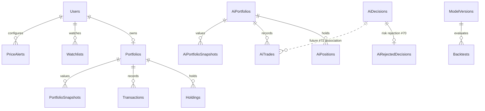

# StockLab relational schema

Design for issue #20. This document specifies the target relational model for
Azure SQL; it does not create tables, EF Core entities, migrations or cloud
resources. Those implementations belong to their respective issues.

## Conventions and boundaries

- `Id` is a `uniqueidentifier` primary key; `AiRejectedDecisions` instead uses its
  original `AiDecisionId` as both primary key and foreign key.
- Columns are required unless marked `NULL`. Dates use `datetime2(7)` in UTC.
- Prices, initial capital and average costs use `decimal(19,4)`; share quantities
  use `decimal(19,8)` to permit fractional shares. User portfolio cash and transaction
  totals use `decimal(27,12)` to preserve the exact quantity × execution-price
  product and the existing 15-digit integer range (#221). AI cash and trade totals
  retain `decimal(19,4)`. Floating-point types are excluded.
  ML logical session dates use SQL `date`; technical recorded timestamps remain UTC.
- Currency is `char(3)`, initially USD. Each portfolio uses one currency; orders
  and valuations in another currency are rejected until FX support is designed.
- Symbols use `nvarchar(32)`, trimmed and normalized to uppercase. The configured
  market-data provider must resolve them unambiguously; exchange-qualified
  identifiers are required if a ticker is ambiguous. No persistent stock catalog
  or market-data cache is introduced by this schema.
  Raw ML decision history instead preserves the identifier accepted by AI risk,
  without introducing additional symbol normalization.
- Status values below are `varchar` columns with database CHECK constraints.
- Mutable aggregates use SQL Server `rowversion` for optimistic concurrency;
  `rowversion` is not a date or business sequence number.
- Foreign keys use NO ACTION on delete. No cascading deletion of financial or
  decision history is allowed. Account deletion/anonymization is a separate policy.
- All tables and accounts describe paper trading only. No broker credentials or
  real execution identifiers are stored.

## Relationships

```mermaid
erDiagram
    Users ||--o| Portfolios : owns
    Users ||--o{ Watchlists : watches
    Users ||--o{ PriceAlerts : configures
    Portfolios ||--o{ Holdings : holds
    Portfolios ||--o{ Transactions : records
    Portfolios ||--o{ PortfolioSnapshots : values
    AiPortfolios ||--o{ AiPositions : holds
    AiPortfolios ||--o{ AiTrades : records
    AiPortfolios ||--o{ AiPortfolioSnapshots : values
    ModelVersions ||--o{ Backtests : evaluates
    AiDecisions ||--o| AiRejectedDecisions : "risk rejection #70"
    AiDecisions ||..o{ AiTrades : "future #72 association"
```

The user-to-portfolio relationship is zero-or-one at the database level. Issue #19
will create exactly one portfolio with registration in the same transaction.
User portfolios and AI portfolios occupy separate tables without sharing balances
or positions. The exact user trading amounts introduced by #221 apply to Portfolios
and Transactions; AI accounting is defined separately below.

## User and paper-trading tables

### Users

| Column | Type / constraint |
| --- | --- |
| Id | Primary key |
| DisplayName | `nvarchar(100)`, nonblank |
| Email | `nvarchar(254)`, nonblank |
| NormalizedEmail | `nvarchar(254)`, unique, nonblank |
| PasswordHash | `nvarchar(1024)`; only the encoded output of the chosen password hasher |
| CreatedAtUtc | `datetime2(7)` |
| UpdatedAtUtc | `datetime2(7)`, >= CreatedAtUtc |
| Version | `rowversion` |

Registration normalizes email consistently before lookup and insert. The unique
index prevents concurrent duplicate registrations. Hash format, validation and
authentication are implemented by #16/#17, not by this document.

### Portfolios

| Column | Type / constraint |
| --- | --- |
| Id | Primary key |
| UserId | FK Users.Id, unique |
| Currency | `char(3)`, initially USD |
| InitialCapital | `decimal(19,4)`, default 100000.0000, > 0 |
| CashBalance | `decimal(27,12)`, default 100000.000000000000, >= 0 |
| CreatedAtUtc | `datetime2(7)` |
| Version | `rowversion` |

InitialCapital is immutable after creation. The application assigns exactly
100000.0000 USD at registration; other funding operations are outside V1.

### Holdings

| Column | Type / constraint |
| --- | --- |
| Id | Primary key |
| PortfolioId | FK Portfolios.Id |
| Symbol | Normalized symbol |
| Quantity | `decimal(19,8)`, > 0 |
| AverageCost | `decimal(19,4)`, > 0 |
| UpdatedAtUtc | `datetime2(7)` |

Unique (PortfolioId, Symbol). Fully sold holdings are removed; their transactions
remain. AverageCost is the weighted acquisition cost per share, not a market quote.
Holdings mutate only inside a transaction that also updates the parent portfolio
with its concurrency token.

### Transactions

| Column | Type / constraint |
| --- | --- |
| Id | Primary key |
| PortfolioId | FK Portfolios.Id |
| OrderId | `uniqueidentifier`, unique within PortfolioId |
| Side | `varchar(4)`: BUY or SELL |
| Symbol | `nvarchar(32)`, canonical `TICKER:EXCHANGE` for orders placed through the trading API |
| RequestedSymbol | `nvarchar(32)`, original normalized client symbol; NULL for older transactions |
| Quantity | `decimal(19,8)`, > 0 |
| OrderType | `varchar(6)`: market or limit |
| LimitPrice | `decimal(19,4)`, positive for limit orders; NULL for market orders |
| ExecutionPrice | `decimal(19,4)`, > 0 |
| TotalAmount | `decimal(27,12)`, > 0 |
| ExecutedAtUtc | `datetime2(7)` |

Append-only ledger of successful executions. Quantity is normalized to eight
decimals and ExecutionPrice to four decimals (midpoints away from zero).
TotalAmount is their exact product, requiring up to twelve decimals; the exact same
amount updates cash without further rounding. The minimum positive trade total is
0.000000000001. At a constant execution price and without fees, cash plus the
remaining position's value is conserved through split BUY/SELL orders.
No fees, deposits, short sales or partial fills are modeled in V1.
OrderId is a stable operation identifier for retries, not a broker order ID.
The trading API uses the quote's exchange metadata to resolve unqualified and
qualified aliases to the same Symbol in both Transactions and Holdings. Distinct
exchanges keep distinct positions. RequestedSymbol permits replaying the original
request without fetching another quote; an alternate alias must resolve to the
same listing. The additive RequestedSymbol migration does not guess exchanges.
When an order touches a legacy unqualified position, the engine resolves its
unqualified symbol independently through the market data provider. Only a matching
listing and portfolio currency allow renaming the position or merging it with an
existing canonical position, summing quantities and weighting acquisition costs.
The same operation normalizes legacy transaction symbols and retains their original
RequestedSymbol, so old order IDs remain replayable. No historical amount, price,
date or order term is changed. Reconciliation is scoped to the portfolio owner and
shares the order's transaction and portfolio concurrency check; rejected or failed
orders roll back all reconciliation changes. Unknown listings are rejected, and
positions on different exchanges remain separate.

The `PreservePaperTradingAmountPrecision` migration widens CashBalance and
TotalAmount without changing existing amounts. Its rollback policy is lossless:
both columns return to `decimal(19,4)` only if every stored value converts exactly.
If any cash balance or trade total would round, become zero or overflow, the
rollback completes while retaining both columns as `decimal(27,12)` and prints
a diagnostic. Rows, IDs, amounts and CHECK constraints are preserved; no minimum
amount is fabricated and no transaction is removed. Upgrading again is supported
from either rollback outcome.

### Watchlists

Each row is one watched symbol for a user; V1 has one implicit list per user.

| Column | Type / constraint |
| --- | --- |
| Id | Primary key |
| UserId | FK Users.Id |
| Symbol | Normalized symbol |
| CreatedAtUtc | `datetime2(7)` |

Unique (UserId, Symbol). Rows can be removed independently of holdings and alerts.

### PriceAlerts

| Column | Type / constraint |
| --- | --- |
| Id | Primary key |
| UserId | FK Users.Id |
| Symbol | Normalized symbol |
| Currency | `char(3)`, initially USD |
| Condition | `varchar(5)`: Above or Below |
| TargetPrice | `decimal(19,4)`, > 0 |
| Status | `varchar(9)`: Active, Disabled or Triggered |
| TriggeredPrice | `decimal(19,4)`, NULL unless Triggered; > 0 when present |
| TriggeredAtUtc | `datetime2(7)`, NULL unless Triggered |
| CreatedAtUtc | `datetime2(7)` |
| UpdatedAtUtc | `datetime2(7)`, >= CreatedAtUtc |
| Version | `rowversion` |

CHECK: Triggered requires both trigger fields; other statuses require both NULL.
TriggeredAtUtc must be >= CreatedAtUtc when present. Multiple targets for the same
symbol are allowed. The monitor shares a quote across alerts for the same symbol
and currency. Proposed condition semantics are strict `price > target` for Above
and `price < target` for Below. Triggered is terminal; creating another alert is
required to rearm. The status change uses a conditional atomic update from Active
so two workers cannot record the same trigger twice.

## AI Trader and ML metadata

### AiPortfolios

Id, Name (`nvarchar(100)`, unique, nonblank), Currency, InitialCapital,
CashBalance, CreatedAtUtc and Version follow Portfolios, with AI CashBalance
remaining `decimal(19,4)`. Initial capital is 100000.0000 USD. There is no UserId or foreign
key to Portfolios. V1 provisions one bot portfolio; a unique Name identifies it.

### AiPositions

Id, AiPortfolioId (FK AiPortfolios.Id), Symbol, Quantity, AverageCost and
UpdatedAtUtc mirror Holdings. Unique (AiPortfolioId, Symbol). Quantity and cost
are positive. Updates participate in the parent AI portfolio concurrency check.

### ModelVersions

| Column | Type / constraint |
| --- | --- |
| Id | Primary key |
| Version | `nvarchar(64)`, unique, nonblank |
| Algorithm | `nvarchar(100)`, nonblank |
| TrainedAtUtc | `datetime2(7)` |
| TrainingDataStartUtc | `datetime2(7)` |
| TrainingDataEndUtc | `datetime2(7)`, >= TrainingDataStartUtc and <= TrainedAtUtc |
| Status | `varchar(9)`: Candidate, Active or Archived |
| ArtifactObjectKey | `nvarchar(1024)`, NULL until stored |
| EvaluationMetricsJson | `nvarchar(max)`, NULL or valid JSON object |

One filtered unique index on Status where Status = 'Active' enforces at most one
active model for the V1 bot. Candidate allows evaluation before promotion. Model
identity and training metadata remain immutable; promotion changes status in a
transaction. Store an S3 object key only, never a signed URL, token or model binary.
JSON metrics contain named values and their evaluation window, not credentials.

### AiDecisions (implemented by #69)

| Column | Type / constraint |
| --- | --- |
| Id | Caller-generated `uniqueidentifier` primary key; no DB default |
| Signal | `varchar(4)`: BUY, SELL or HOLD |
| Symbol | `nvarchar(32)`, nonblank; accepted AI risk identifier preserved |
| Confidence | `decimal(29,28)`, between 0 and 1 inclusive; preserves every .NET decimal score |
| DecisionDate | `date`, logical daily ML session date |
| ModelName | `nvarchar(128)`, required, trimmed, nonblank |
| ModelVersion | `nvarchar(128)`, required, trimmed, nonblank; opaque caller-supplied identity |
| RecordedAtUtc | `datetime2(7)`, backend `TimeProvider` timestamp |

CHECK constraints enforce the signal set, confidence range and nonblank symbol,
model name and model version. All fields are original ML history and append-only.
SQL Server uses binary collation and exact byte lengths for the signal check;
lowercase and padded variants are rejected even under a case-insensitive database.
Every valid BUY/SELL/HOLD is recorded, including low-confidence outputs and decisions
that may later be rejected or never executed. No risk or execution result is stored
here, and recording does not require a portfolio. There are no foreign keys or
rowversion columns in this initial decision table.

The history service rejects an empty ID, invalid symbol/signal, confidence outside
the range, a default/future
UTC decision date, and missing/overlong model identity. Model name/version casing
and accepted symbol casing are preserved. Same ID + identical canonical payload
replays the original timestamp; a changed payload conflicts, including changed
model version. The PK enforces concurrent idempotency. No default version is used.
Reads order by DecisionDate, RecordedAtUtc, Id descending with a limit of 1..200.
Rejection records (#70) now reference this table. Trade associations (#72) and
actual model version lifecycle (#75) remain future work. This implementation supersedes the original #20 target
that combined risk outcome fields and portfolio/model references with ML history.

### AiRejectedDecisions (implemented by #70)

| Column | Type / constraint |
| --- | --- |
| AiDecisionId | `uniqueidentifier` PK and FK to AiDecisions.Id; no generated ID; NO ACTION on delete |
| RejectionReason | Required `varchar(64)`, exact existing `AiRiskRejectionReason` code |
| RejectedAtUtc | Required `datetime2(7)`, backend TimeProvider UTC timestamp |

Each raw decision has zero or one rejection. This table stores no copy of symbol,
signal, confidence, decision date, model name/version, requested price or financial
data. DTO reads join the original decision in one bounded SQL query. The CHECK
constraint permits exactly InvalidDecision, InvalidPrice, HoldSignal, LowConfidence,
CurrencyMismatch, MaxPositionsReached, MaxSymbolExposureReached, InsufficientCash,
NoPositionToSell and TradeTooSmall; SQL Server binary collation and byte-length
checks reject changed casing or padding. The application requires a rejected risk
outcome, defined reason and zero approved quantity, and validates exact symbol,
signal and confidence against an existing raw decision before writing or replaying.

History is append-only: same ID/reason replays the original timestamp, a changed
reason conflicts, and PK races reload the single winner. Reads order by
RejectedAtUtc, AiDecisions.DecisionDate and AiDecisionId descending, with limits
1..200. Risk and execution are not invoked and existing user/AI data is unchanged.
The migration adds only this table and its index; Down drops only this table.

### AiTrades

Id, AiPortfolioId (FK AiPortfolios.Id), Side, Symbol, Quantity, ExecutionPrice,
TotalAmount and ExecutedAtUtc follow Transactions, with AI TotalAmount remaining
`decimal(19,4)` and AI totals and cash rounded to four decimals (midpoints away from
zero). The user amount precision change in #221 does not modify the AI engine.
The decision association remains planned for #72: a DecisionId FK can reference
AiDecisions.Id. No such FK is introduced by #69; AiTrades continues to use the
existing portfolio-scoped OrderId for execution retries.

The application receives a separate risk approval for BUY/SELL and checks the
trade's side and symbol against that approval. The raw AiDecision carries no
approved quantity or risk status. Execution checks current cash and positions again, even
after risk approval; failure leaves no trade row and no financial updates.

### Backtests

| Column | Type / constraint |
| --- | --- |
| Id | Primary key |
| ModelVersionId | FK ModelVersions.Id |
| PeriodStartUtc | `datetime2(7)` |
| PeriodEndUtc | `datetime2(7)`, > PeriodStartUtc |
| InitialCapital | `decimal(19,4)`, > 0 |
| Currency | `char(3)`, initially USD |
| DatasetObjectKey | `nvarchar(1024)`, nonblank; immutable version-specific object key |
| DatasetSha256 | `char(64)`, hexadecimal digest |
| ParametersJson | `nvarchar(max)`, valid JSON object |
| Status | `varchar(9)`: Pending, Running, Completed or Failed |
| CreatedAtUtc | `datetime2(7)` |
| StartedAtUtc | `datetime2(7)`, NULL before start |
| FinishedAtUtc | `datetime2(7)`, NULL until terminal status |
| MetricsJson | `nvarchar(max)`, valid JSON object when Completed, otherwise NULL |
| ResultObjectKey | `nvarchar(1024)`, nonblank when Completed, otherwise NULL |
| FailureReason | `nvarchar(1000)`, nonblank when Failed, otherwise NULL |
| Version | `rowversion` |

CHECK: Pending has no start/finish timestamps; Running has only a start timestamp;
Completed and Failed require both. StartedAtUtc >= CreatedAtUtc and FinishedAtUtc
>= StartedAtUtc whenever present. FailureReason is a sanitized diagnostic.
Parameters record symbols, strategy settings, feature version and random seed;
metrics include return, win rate, drawdown and benchmark under matching conditions.
Historical trades and equity curves are stored in the referenced private result
artifact, not mixed with the bot's actual simulated executions. Dataset keys must
identify immutable data, with the digest used to verify it. Preventing future-data
leakage is a pipeline/backtesting responsibility, not a relational constraint.

## Valuation history

PortfolioSnapshots and AiPortfolioSnapshots support historical equity charts and
drawdown without treating today's quotes as historical prices. Each has Id,
PortfolioId (FK Portfolios.Id) or AiPortfolioId (FK AiPortfolios.Id),
ValuedAtUtc (`datetime2(7)`), CashBalance (`decimal(27,12)` for user snapshots,
`decimal(19,4)` for AI snapshots, >= 0) and
PositionsValue (`decimal(19,4)`, >= 0). Unique (parent ID, ValuedAtUtc).
Total equity is their sum; P&L and return derive from equity and initial capital.
The valuation services must use a consistent as-of quote policy and currency.
These are design-only support tables for the performance issues, not a request
to implement collection now. Precise historical drawdown is limited to the
recorded valuation frequency.

## Indexes and integrity

Besides primary keys and the unique indexes specified above:

| Table | Index / purpose |
| --- | --- |
| Transactions | (PortfolioId, ExecutedAtUtc, Id), (PortfolioId, Symbol, ExecutedAtUtc), (PortfolioId, Side, ExecutedAtUtc): scoped history and filters |
| PriceAlerts | (UserId, Status), filtered (Symbol, Currency) where Status = 'Active': user lists and grouped monitoring |
| AiDecisions | (DecisionDate, RecordedAtUtc, Id): bounded newest-first ML history |
| AiRejectedDecisions | (RejectedAtUtc, AiDecisionId): bounded rejection history joined to the raw decision |
| AiTrades | (AiPortfolioId, ExecutedAtUtc, Id): trade history |
| Backtests | (ModelVersionId, CreatedAtUtc): model evaluations |

Watchlists, Holdings, AiPositions and snapshot parent lookups are covered by their
composite unique indexes. Each implementation should verify query plans before
adding further indexes.

Financial writes require one transaction for ledger insertion, cash update and
position change. Both cash and positions must be revalidated against the current
state; a parent rowversion conflict rolls back the entire transaction. Quantity
must be positive, sales cannot exceed holdings, and cash cannot become negative.
A duplicate operation identifier must not execute again; retries with different
payloads must be rejected. These are requirements for later trading issues, not
stored procedures introduced here.

Database constraints enforce references, uniqueness, local value ranges and status
shapes. Application services enforce ownership, email format, symbol resolution,
currency agreement, permitted status transitions, arithmetic consistency and
cross-table risk checks. Private queries scope by the authenticated user through
Portfolios.UserId or direct UserId; possession of a GUID is never authorization.

## Implementation boundaries and review checks

- #21 provisions Azure SQL; #22 maps the approved schema with EF Core; #23 creates
  and applies migrations. This document can be reviewed independently of #13.
- Later feature issues add only the entities and behavior needed for their scope;
  this target model does not authorize implementing all tables in advance.
- The overlap between #22 entity configuration and #23 initial tables should be
  settled when those issues are implemented: migrations must reflect the model
  actually present, with later tables added by subsequent migrations.
- Review duplicate normalized emails, a second personal portfolio, duplicate
  symbols, negative cash, overselling, concurrent orders, repeated order IDs,
  repeated alert triggers and cross-portfolio AI decision references.
- Verify that HOLD and rejected decisions cannot produce trades, a second active
  model cannot be committed, and failed transactions leave all balances unchanged.
- These are acceptance scenarios for future executable constraints and tests.
  No database, migration, test execution or cloud connectivity is claimed here.
